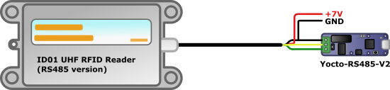

# Library for working with DFRobot ID01 UHF RFID reader using a Yocto-RS485-V2

From time to time, we try products that we find on the market to see what they are worth, 
and whether they can be used with Yoctopuce modules. This is what we did this week with 
the [ID01 UHF RFID reader](https://www.dfrobot.com/product-1246.html), sold 
by DFRobot.

DFRobot products, generally aiming a minimal sale price, don't target the same customers 
as we do, as we are looking for quality as a priority. But this reader caught our 
attention because it uses an RS485 interface, seems to use a robust enclosure, and is 
sold at a price which let us hope that it could be of a good enough quality.


## Connections

This reader needs a 7V / 2A power supply. It's not usual, but you can find it. For 
communication, we opted for the RS485 version, betting that if DFRobot had made an 
RS485 version there was a good possibility for it to be serious. The ID01 
documentation uses the A/B terminology for the communication wires, which is 
unfortunately ambiguous. So FYI, the yellow wire corresponds to TX-/RX-, while the 
green wire corresponds to TX+/RX+. Here is how to connect the reader to a
[Yocto-RS485-V2](https://www.yoctopuce.com/EN/products/usb-electrical-interfaces/yocto-rs485-v2):



## Communication with the reader
 
Communications go through a proprietary binary protocol. By searching the PDF 
documentation and with some trials and errors, we determined how to make the basic 
functions of the reader work with a
[Yocto-RS485-V2](https://www.yoctopuce.com/EN/products/usb-electrical-interfaces/yocto-rs485-v2).
We then wrote  a small Python library enabling you to easily use it from a computer. 
We didn't make a PyPI package for this tiny library. Simply copy the `ID01.py`
file in your project. However, this file uses the `yoctopuce` library to 
communicate with the
[Yocto-RS485-V2](https://www.yoctopuce.com/EN/products/usb-electrical-interfaces/yocto-rs485-v2),
so you must install this 
latter library with PyPI in your project. Here is how to use it:

### Initialization 
When instantiating the library, you indicate if your RS485 interface is connected by 
USB or available through the network at a given IP address (via a 
[YoctoHub-Ethernet](https://www.yoctopuce.com/EN/products/extensions-and-networking/yoctohub-ethernet)
for example, or on a remote machine with the VirtualHub software).
```python
from ID01 import *
rfidReader = ID01("usb")
```

### Connection
Connection with the interface is performed when you call the `connect()` method. 
The library looks for an RS485 interface with the `ID01_RFID` logical name.
```python
status = rfidReader.connect()
if status != "OK":
    sys.exit(status)
```
If the RS485 interface is not found, the `connect()` function returns an 
explicit message.

### Checking the reader version
As we suspect that not all versions of the DFRobot reader work in the same way, we 
implemented a function enabling us to know the software version running on the reader. 
The version for which we tested our code calls itself version "06.50".
```python
print("RFID reader version: "+ rfidReader.getReaderSoftwareVersion())
```

### Reading an RFID tag 
The RFID tag identifier provided with the reader corresponds to 12 bytes (6 words 
of 16 bits). You can obtain them with the `requestTagIdentification()` method, 
which returns a list of 6 values between 0 and 65535 included if a tag is detected, 
an empty list otherwise.
```python
tag = rfidReader.requestTagIdentification()
if len(tag) != 0:
    print("Tag detected: ", tag)
```

### Changing the identifier of an RFID tag 
The tag identifier is in a modifiable data zone of the tag, called "EPC", at 
address 2. We also implemented the method enabling you to write data on the RFID tag, 
in particular to modify this identifier.
```python
EPC_BANK = 1
ID_ADDR = 2
NEW_IDENT = [1,2,3,4,5,6]
status = rfidReader.writeWordsToTag(EPC_BANK, ID_ADDR, NEW_IDENT)
if status != "OK":
    print("Error: "+status)
```

### Reading/writing data in the "User" zone 
Another read/write data zone is also available, with a varying size depending on the 
tags. You can write and read in this zone with the following methods (8 words at a 
time at most): 
```python
USER_BANK = 3
data = rfidReader.readWordsFromTag(USER_BANK, 0, 8)
for i in range(8):
    data[i] += 1
status = rfidReader.writeWordsToTag(USER_BANK, 0, data)
if status != "OK":
    print("Error: "+status)
```

### Diagnosis tools
To test the detection of your RFID tags, the reader has a function allowing you to 
continuously read tags located in the vicinity and to signal with a beep each tag 
detection. You can use the following methods to control this behavior:

```python
status = rfidReader.startContinuousReading()
status = rfidReader.setReaderBuzzer(1)        # 1=ON, 0=OFF
status = rfidReader.stopContinuousReading()
```

## Looking for more ?

This readme is an exercpt of the [blog article](https://www.yoctopuce.com/EN/article/interfacing-the-dfrobot-id01-uhf-rfid-reader)
published on our web site, see you there!
